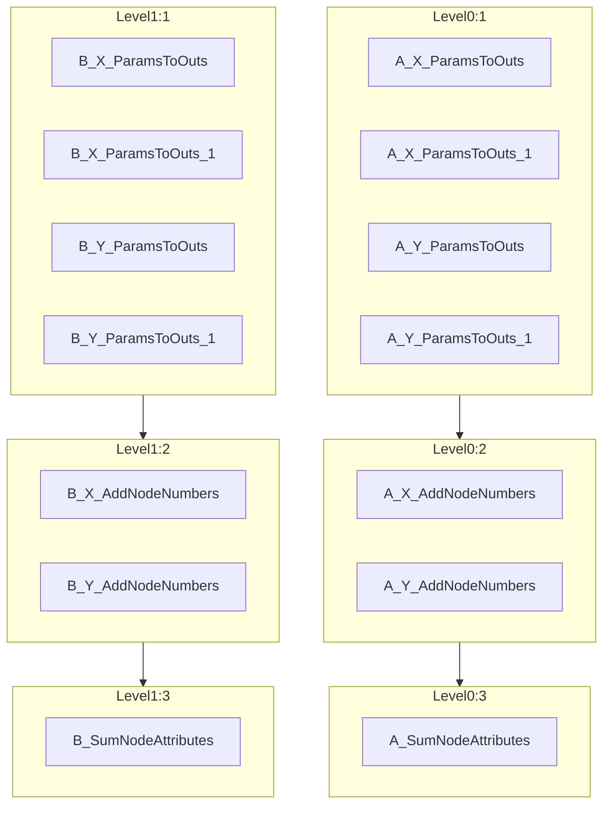

[](https://github.com/zincware)
[](https://badge.fury.io/py/paraffin)
[](https://discord.gg/7ncfwhsnm4)

> [!WARNING]
> [celery](https://github.com/celery/celery) can not handle large workflows and will crash your computer.
> See https://github.com/celery/celery/issues/9475.
> Therefore, `paraffin` should **currently not** be used for large workflows.
> We are working on a solution without relying on `celery`.

# paraffin

Paraffin, derived from the Latin phrase `parum affinis` meaning
`little related`, is a Python package designed to run [DVC](https://dvc.org)
stages in parallel. While DVC does not currently support this directly, Paraffin
provides an effective workaround. For more details, refer to the DVC
documentation on
[parallel stage execution](https://dvc.org/doc/command-reference/repro#parallel-stage-execution).

> [!WARNING]
> `paraffin` is still very experimental.
> Do not use it for production workflows.

## Installation

Install Paraffin via pip:

```bash
pip install paraffin
```

## Usage

The `paraffin submit` command mirrors `dvc repro`, enabling you to queue and execute your entire pipeline or selected stages with parallelization.
If no parameters are specified, the entire graph will be queued and executed via `dvc repro --single-item`.

```bash
paraffin submit <stage name> <stage name> ... <stage name>
# Example: run with a maximum of 4 parallel jobs
paraffin worker --concurrency=4
```

### Parallel Execution
Due to limitations in Celery’s graph handling (see [Celery discussion](https://github.com/celery/celery/discussions/9376)), complete parallelization is not always achievable. Paraffin will display parallel-ready stages in a flowchart format.
All stages are visualized in a [Mermaid](https://mermaid.js.org/) flowchart.




## Queue Labels

To fine-tune execution, you can assign stages to specific Celery queues, allowing you to manage execution across different environments or hardware setups.
Define queues in a `paraffin.yaml` file:

```yaml
queue:
    "B_X*": BQueue
    "A_X_AddNodeNumbers": AQueue
```
Then, start a worker with specified queues, such as celery (default) and AQueue:
```bash
paraffin worker -q AQueue,celery
```
All `stages` not assigned to a queue in `paraffin.yaml` will default to the `celery` queue.


> [!TIP]
> If you are building Python-based workflows with DVC, consider trying
> our other project [ZnTrack](https://zntrack.readthedocs.io/) for a more
> Pythonic way to define workflows.
