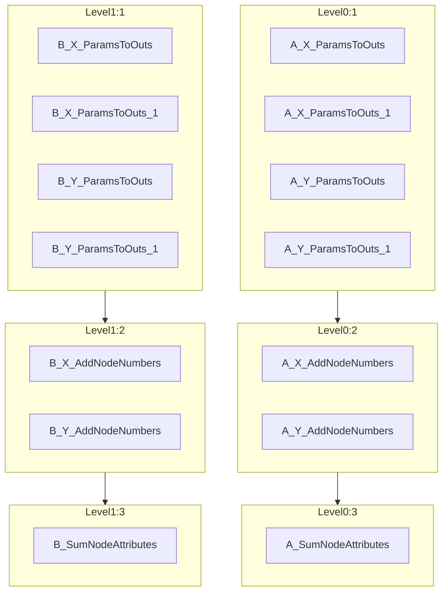

[](https://github.com/zincware)
[](https://badge.fury.io/py/paraffin)

# paraffin

Paraffin, derived from the Latin phrase `parum affinis` meaning
`little related`, is a Python package designed to run [DVC](https://dvc.org)
stages in parallel. While DVC does not currently support this directly, Paraffin
provides an effective workaround. For more details, refer to the DVC
documentation on
[parallel stage execution](https://dvc.org/doc/command-reference/repro#parallel-stage-execution).

> [!WARNING]
> `paraffin` is still very experimental.
> Do not use it for production workflows.

## Installation

Install Paraffin via pip:

```bash
pip install paraffin
```

## Usage

The `paraffin` command replicates the `dvc repro` command.
If you don't give any parameters, the entire graph will be queued and exectued using `dvc repro --single-item`.
`paraffin` will visualize all stages that can run in parallel using [mermaid](https://mermaid.js.org/).
By default, the execution will be queued and needs to be run by manually starting a celery worker.
For more information run `paraffin --help`.

```bash
paraffin <stage name> <stage name> ... <stage name>
# run max 4 jobs in parallel
celery -A paraffin.worker worker --loglevel=WARNING --concurrency=4
```

### Parallel Execution
Due to some limitations of the celery package (https://github.com/celery/celery/discussions/9376), the graph can not be fully parallized.
`paraffin` will show you what it can run in parallel as follows:




## Labels

You can put stages into dedicated celery queues, e.g. to run them from different environments or on shard storage from different hardware.

To configure the stages you need to create a `paraffin.yaml` file as follows:

```yaml
queue:
    "B_X*": BQueue
    "A_X_AddNodeNumbers": AQueue
```

and then start a worker with one or multiple queues using e.g. to run the default queue `celery` and the `AQueue`:
```bash
celery -A paraffin.worker worker -Q AQueue,celery
```

All `stages` that are not part of the `paraffin.yaml` will run on workers that have the `celery` queue assigned.

> \[!TIP\] If you are building Python-based workflows with DVC, consider trying
> our other project [ZnTrack](https://zntrack.readthedocs.io/) for a more
> Pythonic way to define workflows.
