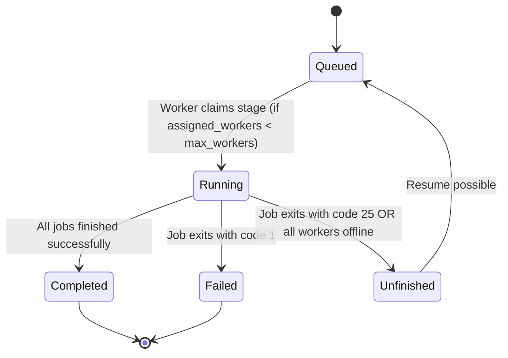
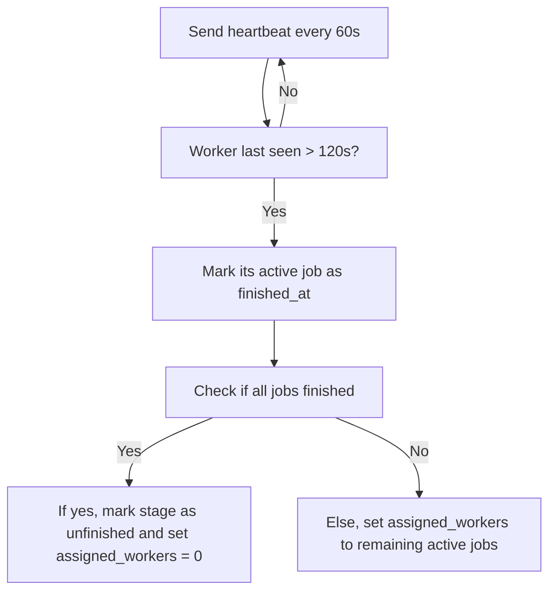

# Development Notes for paraffin

## Definitions
- Stage: a stage in the `dvc.yaml` e.g. a `zntrack.Node`
    - max_workers: Each stage defines how many workers can concurrently execute it. Only max_workers jobs may be running for a given stage at a time.
- Worker: a process that executes jobs (i. e. stages)
- Job: The results from when a worker is processing a Stage. E.g. saving stdout. One Stage can have multiple jobs (workers processing it in parallel) if supported.
- Experiment: All the stages being saved into the DB when `paraffin submit` is called.

1. Stage queued
2. Worker picks up queued Stage, assigns a Job. Stage state changes to `running`
3. 
    - Job finishes succesfully, Stage is set to `finished` 
    - Job failed with exit code 1, Stage is set to `failed`
    - Job failed with exit code 25, Stage is set to `unfinished` and the stage can be resumed by another worker
4. Alternate scenario
    - Worker updates `last_seen` in the database every 60 s (worker hearbeat), if the worker was not seen for 120 s, it is assumed that it was killed. All jobs that are sill active on this worker (max 1) will be set to `finished_at` when the worker was last seen? WHAT TO DO WITH THE STAGE? CHECK IF ALL WORKERS ARE FINISHED AND THEN SET TO `unfinished`?

Scenarios:
#TODO: `claim_stage` should increment assigend_worker and we do not set it to 1 by default
1. one worker: worker goes offline -> stage: unfinished, set assigned_workers to number of online workers, e.g. 0
2. two worker: one goes offline, one still online -> stage: running, set assigned_workers to the number of online workers, e.g. 1
3. two worker: bot go offline -> stage: unfinished, set assigned_workers to the number of online workers, e.g. 0

Summary:
If a worker goes offline, check all assigned jobs, if every job is `finished_at` set the state to `unfinished`, set assigned_workers to 0
If there are some running workers, keep job at `running` but set assigned_workers to the number of jobs that are not `finished_at`

Worker finishes scenario
1. worker finishes, no other `active` workers -> stage finished, job finished_at
2. worker finishes, there are other `active` workers: don't change the stage state.

